# Full Schema Pipeline

## Overview
The Full Schema pipeline loads the entire graph schema and includes it in the LLM prompt. This provides maximum context but uses more tokens.

## Full Schema Pipeline Flow

```mermaid
flowchart TD
    Start([User Query: Find CVEs affecting Windows]) --> Step1[Step 1: Load Full Schema]
    
    Step1 --> Step1a[Read schema_cache.txt]
    Step1a --> Step1b[Load ALL node types:<br/>UcoCVE, UcoCWE, UcoexCPE,<br/>UcoexCAPEC, UcoexGROUPS, etc.]
    Step1b --> Step1c[Load ALL properties:<br/>ucobaseSeverity, cpeName,<br/>ucocweID, ucoexNAME, etc.]
    Step1c --> Step1d[Load ALL relationships:<br/>UCOEXHASCPE, UCOHASWEAKNESS,<br/>UCOEXGROUPUSESTECHNIQUE, etc.]
    
    Step1d --> Step2[Step 2: Build Complete Schema Block]
    Step2 --> Step2a[Format as text:<br/>NODES: 14 types<br/>RELATIONSHIPS: 16 types<br/>PROPERTIES: ~100 total]
    Step2a --> Step2b[Complete schema ~2000 tokens]
    
    Step2b --> Step3[Step 3: Assemble Full Prompt]
    Step3 --> Step3a[Instruction:<br/>You are a Neo4j Cypher expert...]
    Step3a --> Step3b[Full Schema:<br/>All nodes, relationships, properties]
    Step3b --> Step3c[Few-Shot Examples:<br/>28 example queries]
    Step3c --> Step3d[User Question:<br/>Find CVEs affecting Windows]
    
    Step3d --> Step4[Step 4: Call LLM]
    Step4 --> Step4a[Send complete prompt<br/>to Ollama Llama3]
    Step4a --> Step4b[LLM has ALL schema context<br/>Can see all possible relationships]
    Step4b --> Step4c[Generate Cypher query<br/>using full knowledge graph]
    
    Step4c --> Step5[Step 5: Extract Cypher]
    Step5 --> Step5a[Parse LLM response]
    Step5a --> Step5b[Remove markdown formatting]
    Step5b --> Step5c[Extract pure Cypher query]
    
    Step5c --> Step6[Step 6: Basic Validation]
    Step6 --> Step6a[Check MATCH keyword exists]
    Step6a --> Step6b[Check RETURN clause exists]
    Step6b --> Step6c[Check balanced brackets]
    
    Step6c --> Valid{Valid?}
    Valid -->|No| Retry{Attempts < 3?}
    Retry -->|Yes| Step4
    Retry -->|No| Error[Return Error]
    
    Valid -->|Yes| Step7[Step 7: Execute on Neo4j]
    Step7 --> Step7a[Connect to Neo4j database]
    Step7a --> Step7b[Run Cypher query]
    Step7b --> Step7c[Fetch results]
    
    Step7c --> Step8[Step 8: Format Response]
    Step8 --> Step8a[JSON response:<br/>cypher + results]
    Step8a --> End([Return to Frontend])
    Error --> End
    
    classDef schemaStep fill:#fa709a,stroke:#333,stroke-width:2px,color:#000
    classDef promptStep fill:#fee140,stroke:#333,stroke-width:2px,color:#000
    classDef llmStep fill:#667eea,stroke:#333,stroke-width:2px,color:#fff
    classDef executeStep fill:#38ef7d,stroke:#333,stroke-width:2px,color:#000
    
    class Step1,Step1a,Step1b,Step1c,Step1d,Step2,Step2a,Step2b schemaStep
    class Step3,Step3a,Step3b,Step3c,Step3d promptStep
    class Step4,Step4a,Step4b,Step4c,Step5,Step5a,Step5b,Step5c llmStep
    class Step6,Step6a,Step6b,Step6c,Step7,Step7a,Step7b,Step7c,Step8,Step8a executeStep
```



## Key Advantages

1. **Maximum Context**: LLM sees entire graph structure
2. **Complex Queries**: Can handle multi-hop paths across many node types
3. **No Filtering Overhead**: Direct schema load, no similarity computation
4. **Comprehensive**: Works for any query type without pre-filtering

## Example Query Flow

**User Query**: "Find CVEs affecting Windows"

**Full Schema Provided to LLM**:
```
NODES:
- UcoCVE {label, ucobaseSeverity, ucoevaluatorSolution, ...}
- UcoCWE {ucoabstraction, ucoapplicablePlatform, ...}
- UcoexCPE {cpeName, cpeNameId, titles, lastModified, ...}
- UcoexCAPEC {ucoexCAPEC_id, ucoexCAPEC_name, ...}
- UcoexGROUPS {ucoexNAME, ucoexDESCRIPTION, ...}
- UcoexMITREATTACK {ucoexNAME, ucoexDESCRIPTION, ...}
- ... (all 14 node types)

RELATIONSHIPS:
- (:UcoCVE) -[:UCOEXHASCPE]-> (:UcoexCPE)
- (:UcoCWE) -[:UCOHASOBSERVEDEXAMPLE]-> (:UcoexObservedExample)
- (:UcoexCAPEC) -[:UCOEXHASRELATEDWEAKNESS]-> (:UcoCWE)
- (:UcoexGROUPS) -[:UCOEXGROUPUSESTECHNIQUE]-> (:UcoexMITREATTACK)
- ... (all 16 relationship types)

EXAMPLES:
1. "Show all CVEs with HIGH severity"
   → MATCH (cve:UcoCVE) WHERE cve.ucobaseSeverity = 'HIGH' RETURN cve LIMIT 10
2. "Find CVEs that affect Microsoft Windows platforms"
   → MATCH (cve:UcoCVE)-[:UCOEXHASCPE]->(cpe:UcoexCPE) WHERE cpe.cpeName CONTAINS 'microsoft:windows' RETURN cve
... (28 examples total)
```

**Generated Cypher**:
```cypher
MATCH (cve:UcoCVE)-[:UCOEXHASCPE]->(cpe:UcoexCPE)
WHERE cpe.cpeName CONTAINS 'microsoft:windows'
RETURN cve LIMIT 10
```

## Prompt Structure

### 1. Instruction Section (~200 tokens)
```
You are a Neo4j Cypher expert for a Cybersecurity Knowledge Graph.

Hard constraints (must follow):
- Use EXACT labels and relationship types from the schema
- Use only valid connections shown in RELATIONSHIPS
- Return ONLY the Cypher query
- NO SQL syntax: Do NOT use GROUP BY, HAVING, or JOIN
...
```

### 2. Schema Section (~2000 tokens)
```
NODES: [All 14 node types with properties]
RELATIONSHIPS: [All 16 relationship patterns]
```

### 3. Examples Section (~800 tokens)
```
28 few-shot examples covering:
- Single node property queries
- Relationship traversal
- Property filtering
- Aggregation
```

### 4. User Question (~50 tokens)
```
User question: Find CVEs affecting Windows
```

**Total Prompt Size**: ~3000 tokens

## Technical Details

### File Locations
- **Schema Cache**: `qa-engine/shared/schema_cache.txt`
- **Pipeline Code**: `qa-engine/text2cypher/backend/text2cypher.py`
- **Configuration**: `qa-engine/text2cypher/backend/config.py`

### Environment Variables
```bash
export USE_T2CSS=false  # Use full schema mode
```

### Schema Cache Format
```
NODES:
UcoCVE {label: string, ucobaseSeverity: string, ucoexploitabilityScore: string, ...}
UcoCWE {ucoabstraction: string, ucoapplicablePlatform: string, ...}
...

RELATIONSHIPS:
(:UcoCVE) -[:UCOEXHASCPE]-> (:UcoexCPE)
(:UcoCWE) -[:UCOHASOBSERVEDEXAMPLE]-> (:UcoexObservedExample)
...
```

## Performance Metrics

| Metric | Value |
|--------|-------|
| Schema Load Time | ~10ms |
| Total Prompt Tokens | ~3000 |
| LLM Response Time | 3-5 seconds |
| Validation Time | ~5ms |
| Neo4j Execution | 10-500ms (query dependent) |
| Accuracy | High (95-98%) |

## When to Use Full Schema

✅ **Best for**:
- Complex multi-hop queries
- Exploratory queries
- Queries spanning multiple node types
- When accuracy is critical
- Development and testing

❌ **Not ideal for**:
- High-volume production
- Token cost optimization
- Simple single-node queries
- Real-time applications

## Comparison with T2CSS

| Aspect | Full Schema | T2CSS Filtered |
|--------|-------------|----------------|
| Schema Size | All elements (~50) | Top-K elements (~10) |
| Prompt Tokens | ~3000 | ~1200 |
| LLM Time | 3-5s | 2-3s |
| Filtering Time | 0ms | ~150ms |
| Total Time | 3-5s | 2.2-3.2s |
| Best Use Case | Complex queries | Simple queries |
| Token Cost | Higher | 60% lower |
| Setup Required | None | One-time embedding |
