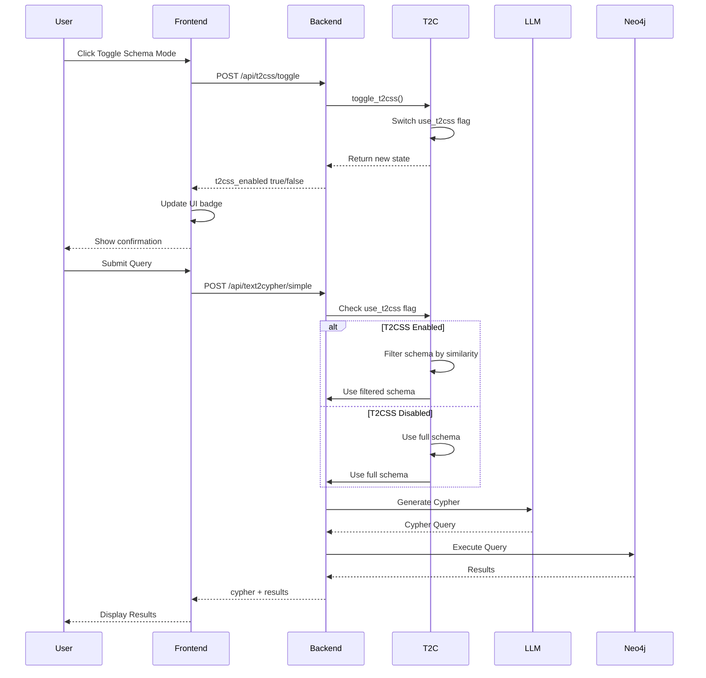

# Text2Cypher Pipeline Flowchart

This flowchart illustrates the complete Text2Cypher pipeline with both Full Schema and T2CSS Filtered modes.

## Pipeline Flow Diagram

```mermaid
flowchart TD
    Start([User Natural Language Query]) --> APIEntry[FastAPI Endpoint /api/text2cypher/simple]
    
    APIEntry --> CheckToggle{T2CSS Mode Enabled?}
    
    CheckToggle -->|No - Full Schema| LoadFullSchema[Load Full Schema from schema_cache.txt]
    LoadFullSchema --> BuildFullPrompt[Build Prompt with FULL Schema]
    
    CheckToggle -->|Yes - T2CSS Filtered| LoadCache{Schema Embeddings Cached?}
    
    LoadCache -->|Yes| LoadEmbeddings[Load Pre-computed Embeddings from JSON]
    LoadCache -->|No| GenerateTriples[Generate Semantic Triples from schema_cache.txt]
    
    GenerateTriples --> EmbedTriples[Embed Triples using Ollama nomic-embed-text]
    EmbedTriples --> SaveEmbeddings[Save Embeddings to schema_embeddings.json]
    SaveEmbeddings --> FilterSchema[Filter Schema by Cosine Similarity]
    
    LoadEmbeddings --> FilterSchema
    
    FilterSchema --> EmbedQuery[Embed User Query using Ollama]
    EmbedQuery --> ComputeSimilarity[Compute Cosine Similarity with All Schema Triples]
    ComputeSimilarity --> SelectTopK[Select Top-K Most Relevant Schema Elements]
    SelectTopK --> BuildFilteredPrompt[Build Prompt with FILTERED Schema]
    
    BuildFullPrompt --> AssemblePrompt[Assemble Final Prompt: Instruction + Schema + Examples]
    BuildFilteredPrompt --> AssemblePrompt
    
    AssemblePrompt --> CallLLM[Call LLM Ollama/Gemma]
    
    CallLLM --> ExtractCypher[Extract Cypher Query from LLM Response]
    
    ExtractCypher --> ValidateSyntax{Basic Syntax Valid?}
    
    ValidateSyntax -->|Invalid| RetryCount{Retry < 3?}
    RetryCount -->|Yes| CallLLM
    RetryCount -->|No| Error500[Return 500 Error]
    
    ValidateSyntax -->|Valid| ExecuteNeo4j[Execute Cypher on Neo4j Database]
    
    ExecuteNeo4j --> CheckResults{Execution Successful?}
    
    CheckResults -->|Neo4j Error| ErrorMsg[Return Error Message with Generated Cypher]
    CheckResults -->|Success| FormatResults[Format Results as JSON]
    
    FormatResults --> ReturnResponse[Return Response: cypher + results]
    ErrorMsg --> End([End])
    Error500 --> End
    ReturnResponse --> End
    
    ToggleButton[Frontend Toggle Button] -.->|POST /api/t2css/toggle| ToggleEndpoint[Backend Toggle Endpoint]
    ToggleEndpoint -.-> UpdateState[Update use_t2css State Variable]
    UpdateState -.-> CheckToggle
    
    classDef fullPath fill:#fa709a,stroke:#333,stroke-width:2px,color:#000
    classDef t2cssPath fill:#11998e,stroke:#333,stroke-width:2px,color:#fff
    classDef sharedPath fill:#667eea,stroke:#333,stroke-width:2px,color:#fff
    classDef errorPath fill:#ff6b6b,stroke:#333,stroke-width:2px,color:#fff
    classDef togglePath fill:#ffd93d,stroke:#333,stroke-width:2px,color:#000
    
    class LoadFullSchema,BuildFullPrompt fullPath
    class LoadCache,GenerateTriples,EmbedTriples,SaveEmbeddings,FilterSchema,EmbedQuery,ComputeSimilarity,SelectTopK,BuildFilteredPrompt t2cssPath
    class AssemblePrompt,CallLLM,ExtractCypher,ExecuteNeo4j,FormatResults,ReturnResponse sharedPath
    class ValidateSyntax,RetryCount,Error500,ErrorMsg,CheckResults errorPath
    class ToggleButton,ToggleEndpoint,UpdateState togglePath
```



## Toggle Workflow Sequence



## Pipeline Components

### 1. Entry Point
- User submits natural language query via frontend
- FastAPI receives request at `/api/text2cypher/simple`

### 2. Mode Selection (Toggle)
- **Full Schema Mode**: Uses entire schema in prompt (~2000 tokens)
- **T2CSS Filtered Mode**: Uses only top-K relevant schema elements (~500 tokens)
- Toggle controlled via `/api/t2css/toggle` endpoint

### 3. Full Schema Path (Pink)
```
schema_cache.txt → Load Full Schema → Build Prompt → LLM
```

### 4. T2CSS Filtered Path (Green)
```
schema_cache.txt → Generate Semantic Triples → Embed with Ollama
→ Compute Cosine Similarity → Select Top-K → Build Prompt → LLM
```
- **One-time Setup**: Generate and cache embeddings
- **Per Query**: Embed query, compute similarity, filter schema

### 5. Shared LLM Pipeline (Purple)
```
Assemble Prompt → Call LLM → Extract Cypher → Validate → Execute → Return Results
```

### 6. Error Handling (Red)
- Basic syntax validation
- Retry up to 3 times on validation failure
- Return error with generated Cypher for debugging

## Key Files

| Component | File Path |
|-----------|-----------|
| Main API | `qa-engine/text2cypher/backend/main.py` |
| Text2Cypher Core | `qa-engine/text2cypher/backend/text2cypher.py` |
| T2CSS Pipeline | `qa-engine/text2cypher/backend/t2css_pipeline.py` |
| T2CSS Integration | `qa-engine/text2cypher/backend/t2css_integration.py` |
| Configuration | `qa-engine/text2cypher/backend/config.py` |
| Schema Cache | `qa-engine/shared/schema_cache.txt` |
| Embeddings Cache | `qa-engine/text2cypher/backend/schema_embeddings.json` |
| Frontend Toggle | `qa-engine/text2cypher/frontend/src/App.js` |

## Environment Variables

```bash
# Enable T2CSS Filtered Mode
export USE_T2CSS=true
export T2CSS_TOP_K=10

# Disable T2CSS (Full Schema Mode)
export USE_T2CSS=false
```

## Performance Comparison

| Metric | Full Schema | T2CSS Filtered |
|--------|-------------|----------------|
| Schema Tokens | ~2000 | ~500 |
| Prompt Build Time | 10ms | 150ms (with filtering) |
| LLM Response Time | 3-5s | 2-3s (shorter context) |
| Accuracy | High (all context) | High (relevant context) |
| Token Cost | Higher | Lower (60% reduction) |

## Decision Points

### When to Use Full Schema?
- ✅ Complex multi-hop queries spanning many node types
- ✅ Exploratory queries where relationships are unknown
- ✅ Maximum accuracy is critical
- ✅ Token cost is not a concern

### When to Use T2CSS Filtered?
- ✅ Simple queries with known entity types
- ✅ High-volume production environments
- ✅ Token cost optimization needed
- ✅ Faster response times desired
- ✅ Query patterns are well-understood

## Troubleshooting

### T2CSS Not Working?
1. Check embeddings cache exists: `schema_embeddings.json`
2. Verify Ollama is running: `curl http://localhost:11434`
3. Check `nomic-embed-text` model is installed
4. Review backend logs for initialization errors

### Toggle Not Responding?
1. Verify T2CSS instance: `hasattr(t2c, 't2css_pipeline')`
2. Check USE_T2CSS environment variable
3. Ensure backend was initialized with T2CSS support
4. Restart backend after changing environment variables

### Poor Query Results?
1. Try toggling between modes
2. Increase `T2CSS_TOP_K` for more schema context
3. Check schema_cache.txt is up-to-date
4. Review prompt rules in `config.py`
